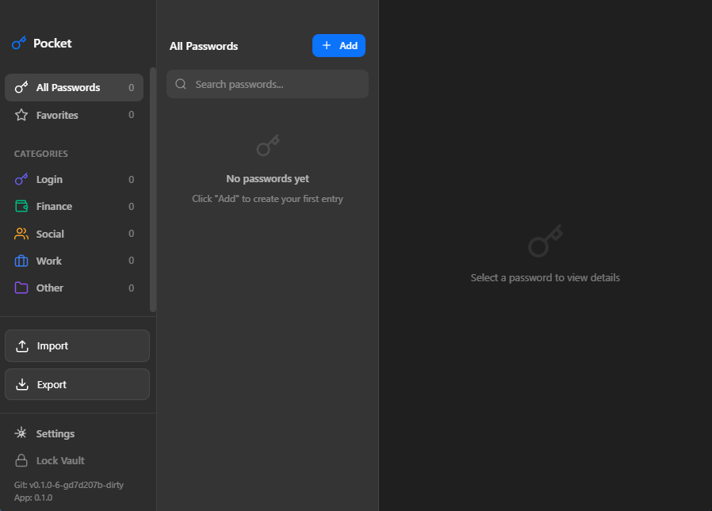

# Pocket

*store some passwords in your pocket or something.*

This app was a password manager I built for windows because I enjoy the passwords app on mac. I have never written a line of rust code before, so I created this app completely doing agentic coding.



## Features

- **Secure**: AES-256-GCM encryption with Argon2id key derivation
- **Beautiful**: Liquid glass UI with native transparency effects
- **Cross-platform**: macOS, Windows, and Linux support
- **Fast**: Built with Rust and React for optimal performance
- **Offline**: All data stored locally, no cloud sync
- **Organized**: Categories, favorites, and search
- **Import/Export**: Import from Chrome/Edge CSV exports, export your passwords
- **Settings**: Clear all passwords and manage your vault
- **Keyboard Shortcuts**: Full keyboard navigation support (Ctrl+/ for shortcuts)

## Quick Start

### Prerequisites

- [Node.js](https://nodejs.org/) 18+
- [Rust](https://rustup.rs/)
- Platform-specific dependencies (see [Development Guide](docs/development.md))

### Development

```bash
# Install dependencies
npm install

# Start development server
npm run tauri:dev
```

### Build

```bash
# Build for your platform
npm run tauri:build
```

Find installers in `src-tauri/target/release/bundle/`.

## Documentation

- [Development Guide](docs/development.md) - Setup and project structure
- [Security](docs/security.md) - Encryption and data storage details
- [Building](docs/building.md) - Release builds and code signing

## Tech Stack

- **Frontend**: React 19, TypeScript, Vite
- **Backend**: Rust, Tauri 2
- **Encryption**: AES-256-GCM, Argon2id
